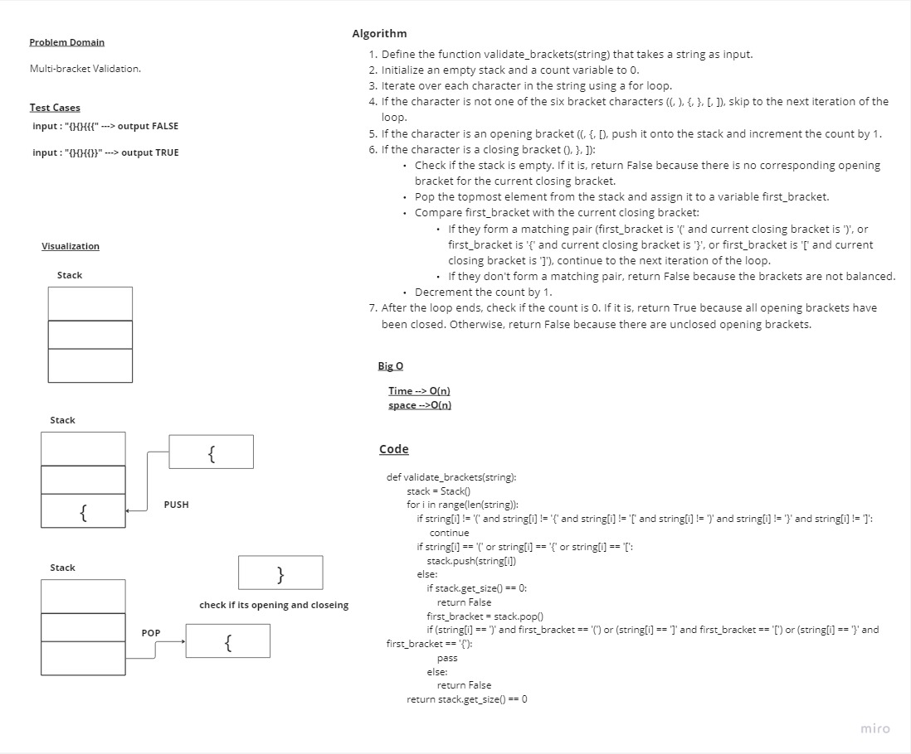

# Stack and Queues brackets

> - Write a function called validate brackets

## Whiteboard Process



## Approach & Efficiency

> - Time --> O(n)
> - space -->O(n)

## Solution

```
def validate_brackets(string):
        stack = Stack()
        count = 0
        for i in range(len(string)):
            if string[i] != '(' and string[i] != '{' and string[i] != '[' and string[i] != ')' and string[i] != '}' and string[i] != ']':
                 continue
            if string[i] == '(' or string[i] == '{' or string[i] == '[':
                stack.push(string[i])
                count += 1
            else:
                if stack.get_size() == 0:
                    return False
                first_bracket = stack.pop()
                if (string[i] == ')' and first_bracket == '(') or (string[i] == ']' and first_bracket == '[') or (string[i] == '}' and first_bracket == '{'):
                    pass
                else:
                    return False
                count -= 1
        return count == 0
```
