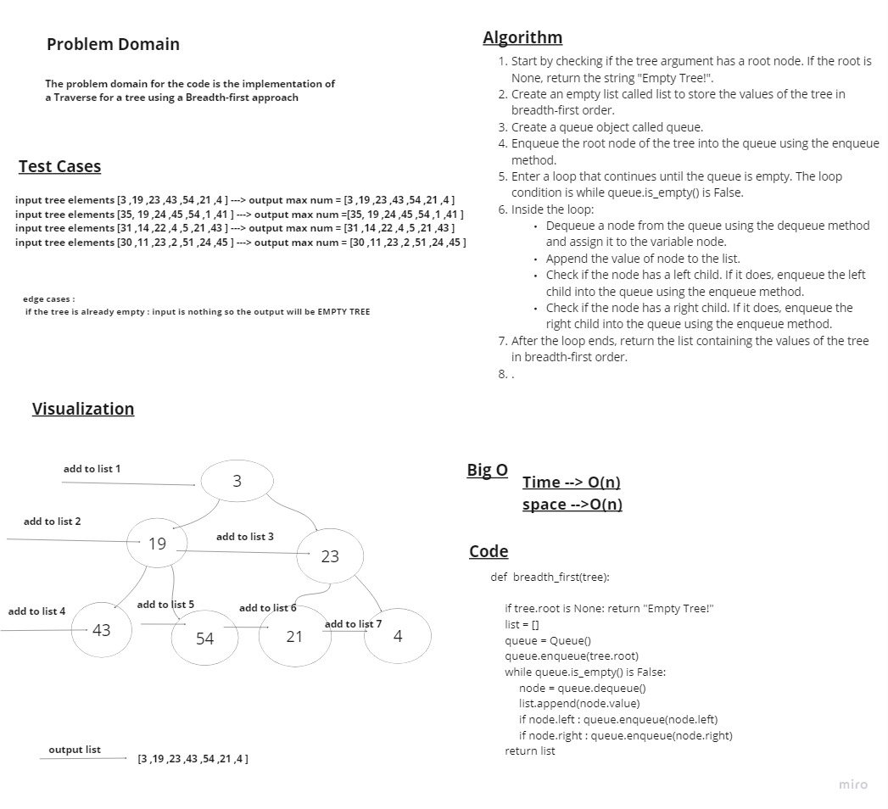

# Stacks and Queues

> - create a Stack and Queue classes

## Whiteboard Process

## pre_order


## in_order


## post_order


## Add nodes


## Contain


## Get_max


## breadth_first



## Approach & Efficiency

> - Time --> O(log n) , O(n) check whiteboard for more info
> - space -->O(1) , O(n) check whiteboard for more info

## Solution

```python
class BinaryTree:
    def __init__(self):
        self.root = None

    def pre_order (self,root):
        if self.root == None : return []
        list=[]
        def recursive (root):
            list.append(root.value)
            if root.left : recursive(root.left)
            if root.right : recursive(root.right)
        recursive(root)
        return list

    def in_order(self,root):
        if self.root == None : return []
        list =[]
        def recursive (root):
           if root.left : recursive(root.left)
           list.append(root.value)
           if root.right : recursive(root.right)
        recursive(root)
        return list

    def post_order(self,root):
        if self.root == None : return []
        list=[]
        def recursive (root):
             if root.left : recursive(root.left)
             if root.right : recursive(root.right)
             list.append(root.value)
        recursive(root)
        return list

     def find_maximum_value(self):
         if self.root is None : return "Empty Tree!"
         if self.max is None : self.max = self.root.value
         def find_max (root):
              if root.left: find_max(root.left)
              if root.right: find_max(root.right)
              if root.value > self.max:
                    self.max = root.value

         find_max(self.root)
         return self.max

class BinarySearchTree(BinaryTree):
     def __init__(self):
          super().__init__()

     def add(self,value):
          if self.root == None: self.root = Node(value)
          else: self.add_recursion(self.root,value)
     def add_recursion(self,root,value):
          if root.value == value: print('value already exists')
          elif root.value > value:
               if root.left: self.add_recursion(root.left,value)
               else: root.left = Node(value)
          elif root.value < value:
               if root.right: self.add_recursion(root.right,value)
               else: root.right = Node(value)

     def contain(self,value):
          if self.root is None : return "Empty Tree!"
          if self.root.value == value: return True
          current = self.root
          while True:
               if current is None: return False
               elif current.value > value: current = current.left
               elif current.value < value: current = current.right
               else: return True

def  breadth_first(tree):
     """
     this function takes a tree as an arguments the add the root to the queue then enter a loop with a condtion that keep looping until the queue is empty
     inside the loop it dequeue from the queue and store the returned node from the dequeue and push it into the list thhen check if it has a left node add it to the queue and if it has a right value add it to the queue
     after the loop ends it return the list
     """
     if tree.root is None: return "Empty Tree!"
     list = []
     queue = Queue()
     queue.enqueue(tree.root)
     while queue.is_empty() is False:
          node = queue.dequeue()
          list.append(node.value)
          if node.left : queue.enqueue(node.left)
          if node.right : queue.enqueue(node.right)
     return list
```
