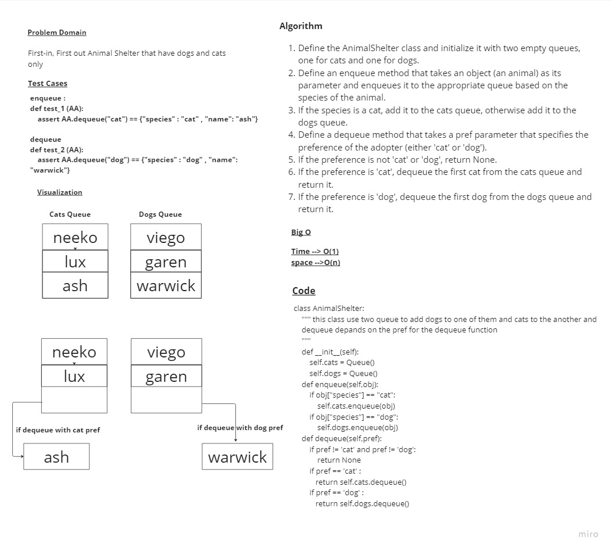

# Animal shelter Queue

> - create an animal shelter class as a queue

## Whiteboard Process



## Approach & Efficiency

> - Time --> O(1)
> - space -->O(n)

## Solution

```(python)
class AnimalShelter:
    """ this class use two queue to add dogs to one of them and cats to the another and
    dequeue depands on the pref for the dequeue function
    """
    def __init__(self):
        self.cats = Queue()
        self.dogs = Queue()

    def enqueue(self,obj):
        if obj["species"] == "cat":
            self.cats.enqueue(obj)
        if obj["species"] == "dog":
            self.dogs.enqueue(obj)
    def dequeue(self,pref):
        if pref != 'cat' and pref != 'dog':
            return None
        if pref == 'cat' :
           return self.cats.dequeue()
        if pref == 'dog' :
           return self.dogs.dequeue()
```
