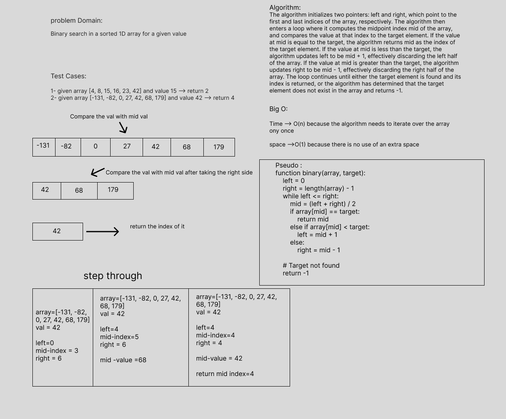

# array-binary-search

> - Binary search in a sorted 1D array

## Whiteboard Process

> - The algorithm initializes two pointers: left and right, which point to the first and last indices of the array, respectively. The algorithm then enters a loop where it computes the midpoint index mid of the array, and compares the value at that index to the target element. If the value at mid is equal to the target, the algorithm returns mid as the index of the target element. If the value at mid is less than the target, the algorithm updates left to be mid + 1, effectively discarding the left half of the array. If the value at mid is greater than the target, the algorithm updates right to be mid - 1, effectively discarding the right half of the array. The loop continues until either the target element is found and its index is returned, or the algorithm has determined that the target element does not exist in the array and returns -1.

## Approach & Efficiency

> - Time --> O(n) because the algorithm needs to iterate over the array once
> - space -->O(1) because there is no use of an extra space

## Solution

