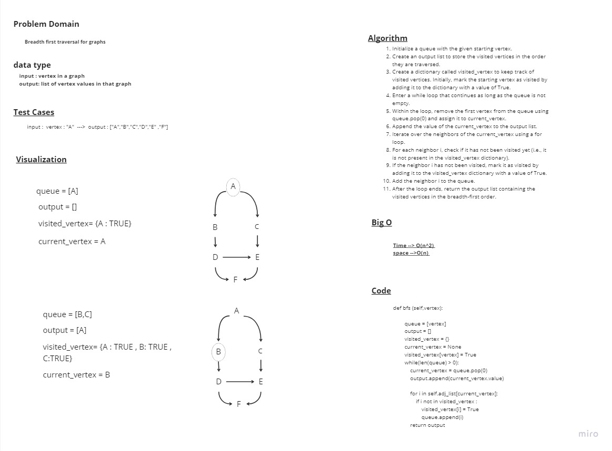

# Code Challenge 35

## Class of Graph

## add_vertex function

arguments : value

big O

time : O(1) space : O(1)

Approach

this function gets a value and creates a new node from it then adds it to the adj_list as a key with an empty list as a value for that key

## add_edge function

arguments : vertex1, vertex2, weight : optional

returns: nothing

big O

time : O(1) space : O(1)

Approach

this function gets called with to vertices and an optional weight parameter then checks if the two vertices exist in the adj_list then create an edg from both vertices and add them to the list of edges for each one of them

## get_vertices function

arguments : None

returns: a list of vertices

big O

time : O(n) space : O(n)

Approach

this function is called with no arguments and returns a list of vertices

## get_neighbors function

arguments : vertex

returns: list of edges of the vertex

big O

time : O(n) space : O(n)

Approach

this function is called with a vertex as an argument and returns a list of edges connected to it

## get_size function

arguments : none

returns: size

big O

time : O(1) space : O(1)

Approach

this function is called with no arguments and returns the size of the graph

## bfs function

arguments : vertex

returns: list of the vertices in the graph

big O

time : O(n^2) space : O(n)

Approach

this function will declare a queue with the given vertex in it,output list ,visited vertex dict and a current vertex then mark the given vertex as visited by adding it to the visited vertex dictionary then using a while loop to loop until the queue is empty in the loop it pop the first vertex in the queue and append its value to the output list then do a for loop to loop over the neighbors of the current vertex and adds its values to the queue and mark them as visted by adding them to the visited vertex dictionary with a value of True

### whitebored :



### Solution

```python
def bfs (self,vertex):
        queue = [vertex]
        output = []
        visited_vertex = {}
        current_vertex = None
        visited_vertex[vertex] = True

        while(len(queue) > 0):
            current_vertex = queue.pop(0)
            output.append(current_vertex.value)

            for i in self.adj_list[current_vertex]:
                if i not in visited_vertex :
                    visited_vertex[i] = True
                    queue.append(i)
            return output
```
