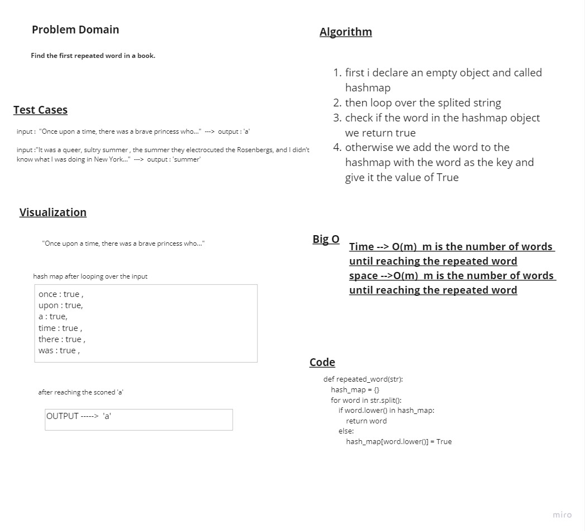

# Hashmap repeated word

> - create a hashmap-repeated-word function

## Whiteboard Process



## Approach & Efficiency

> - Time --> O(m) m is the number of words until reaching the repeated word
> - space -->O(m) m is the number of words until reaching the repeated word

## Solution

```python
def repeated_word(str):
    hash_map = {}
    for word in str.split():
        if word.lower() in hash_map:
            return word
        else:
            hash_map[word.lower()] = True
```
