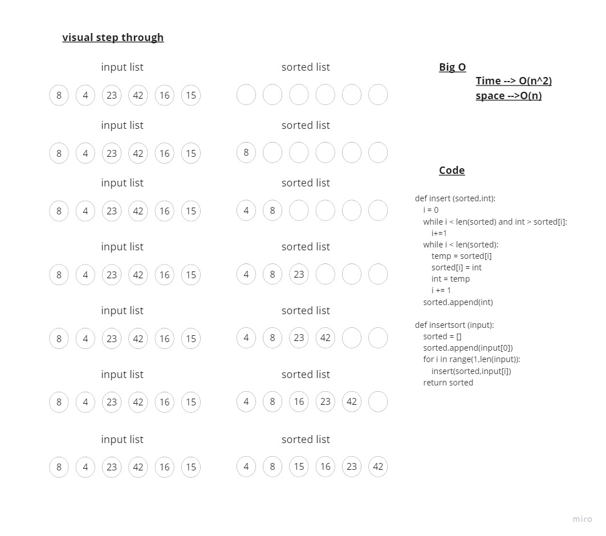

# insertion sort

> - sort the list acordding tto the insetion method

## Approach & Efficiency

> - Time --> O(n^2) becuse the insartion sort calls the insert function inside a loop and the insert have a loop in it so its nested loop
> - space --> O(n) because we declared a new list to add the sortted numbers in it so the space depandes on the size of the input list

## Solution

