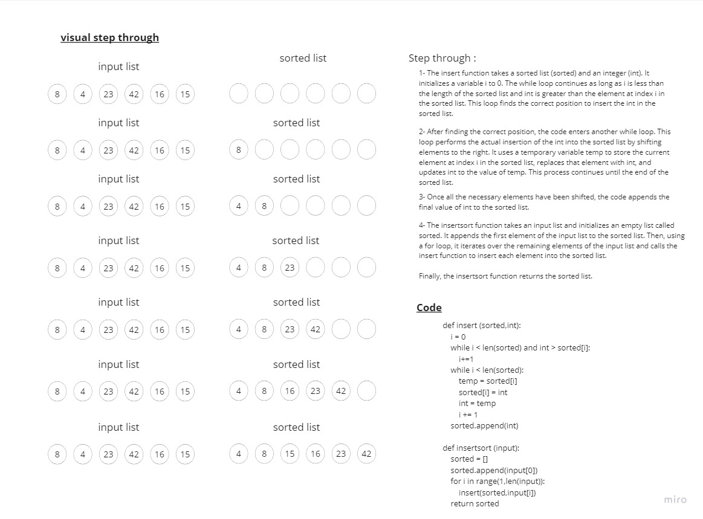

# insertion sort

> - sort the list acordding tto the insetion method

## Approach & Efficiency

> - Time --> O(n^2) because the algorithm needs to iterate over the array once
> - space -->O(n) because there is no use of an extra space

## Solution

