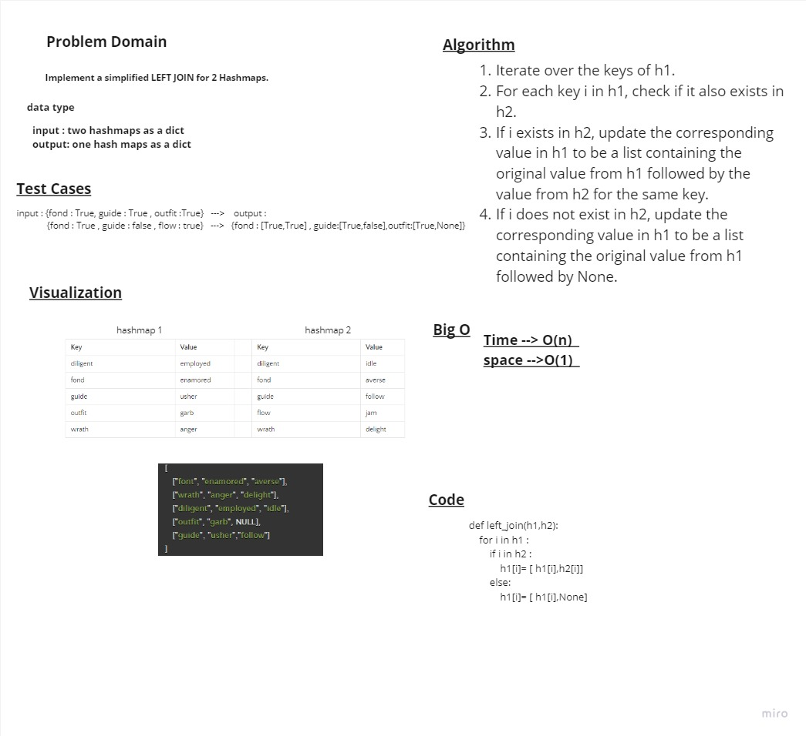

# lef join

> - Implement a simplified LEFT JOIN for 2 Hashmaps.

## Whiteboard Process



## Approach & Efficiency

> - Time --> O(n)
> - space -->O(1)

## Solution

```python
def left_join(h1,h2):
    """this function loops over the h1 hashmap and check if the key in h2 then reasign the key of h1 to list contain the values of the two hash maps
    otherwise it reasign the key of h1 to list that contain the h1 value of the key and None value"""
    for i in h1 :
        if i in h2 :
            h1[i]= [ h1[i],h2[i]]
        else:
            h1[i]= [ h1[i],None]
```
