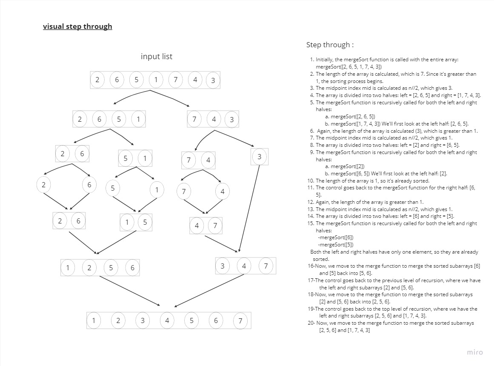

# Merge sort

> - sort the list acordding to the merge sort method

## Approach & Efficiency

> - Time --> O(nlog n) becuse the merge sort function calls him self recursivly and that is log n and call the merge function which have O(n) time complixty
> - space --> O(n) because we declared anew lists called left and right

## Solution

