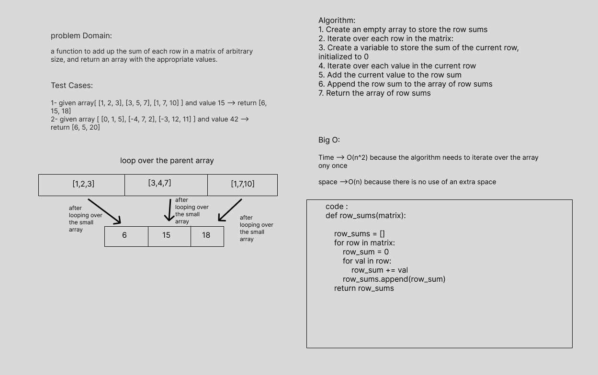

# array-binary-search

> - sum of array of arrays and return an array with the appropriate values

## Whiteboard Process

> - Create an empty array to store the row sums
> - Iterate over each row in the matrix:
> - Create a variable to store the sum of the current row, initialized to 0
> - Iterate over each value in the current row
> - Add the current value to the row sum
> - Append the row sum to the array of row sums
> - Return the array of row sums

## Approach & Efficiency

> - Time --> O(n^2) because the algorithm needs to iterate over the array once
> - space -->O(n) because there is no use of an extra space

## Solution

