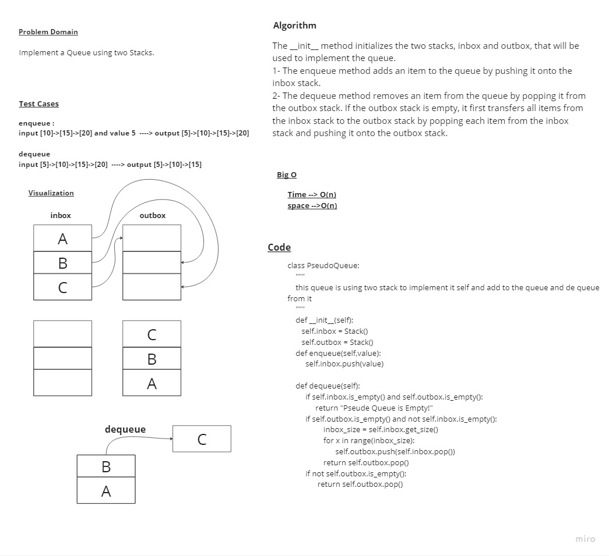

# Queues Using two Stacks

> - create a Queue classes uses stack class

## Whiteboard Process



## Approach & Efficiency

> - Time --> O(n)
> - space -->O(n)

## Solution

```python
class PseudoQueue:
    """
    this queue is using two stack to implement it self and add to the queue and de queue from it
    """
    def __init__(self):
       self.inbox = Stack()
       self.outbox = Stack()

    def enqueue(self,value):
         self.inbox.push(value)

    def dequeue(self):
         if self.inbox.is_empty() and self.outbox.is_empty():
              return "Pseude Queue is Empty!"
         if self.outbox.is_empty() and not self.inbox.is_empty():
                  inbox_size = self.inbox.get_size()
                  for x in range(inbox_size):
                        self.outbox.push(self.inbox.pop())
                  return self.outbox.pop()
         if not self.outbox.is_empty():
               return self.outbox.pop()
```
