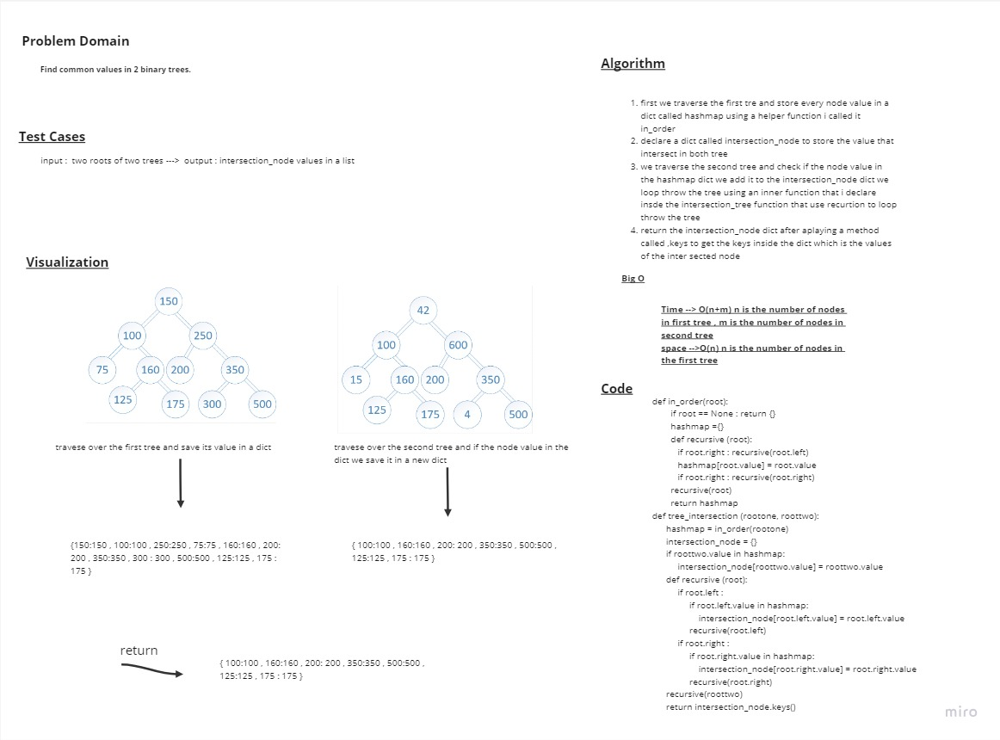

# Tree intersection

> - create a tree_intersection function

## Whiteboard Process



## Approach & Efficiency

> - Time --> O(n+m) n is the number of nodes in first tree , m is the number of nodes in second tree
> - space -->O(n) n is the number of nodes in the first tree

## Solution

```python
def in_order(root):
        if root == None : return {}
        hashmap ={}
        def recursive (root):
           if root.right : recursive(root.left)
           hashmap[root.value] = root.value
           if root.right : recursive(root.right)
        recursive(root)
        return hashmap

def tree_intersection (rootone, roottwo):
      hashmap = in_order(rootone)
      intersection_node = {}
      if roottwo.value in hashmap:
           intersection_node[roottwo.value] = roottwo.value
      def recursive (root):
           if root.left :
                if root.left.value in hashmap:
                    intersection_node[root.left.value] = root.left.value
                recursive(root.left)
           if root.right :
                if root.right.value in hashmap:
                    intersection_node[root.right.value] = root.right.value
                recursive(root.right)
      recursive(roottwo)
      return intersection_node.keys()
```
